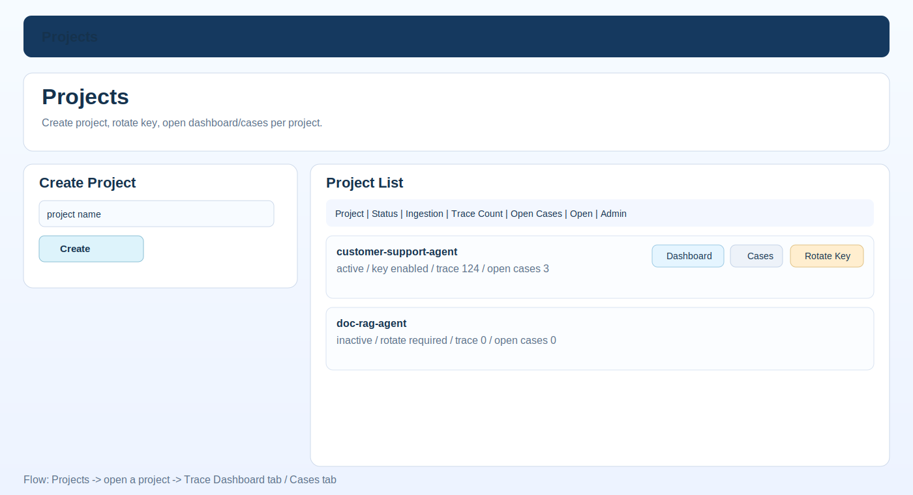
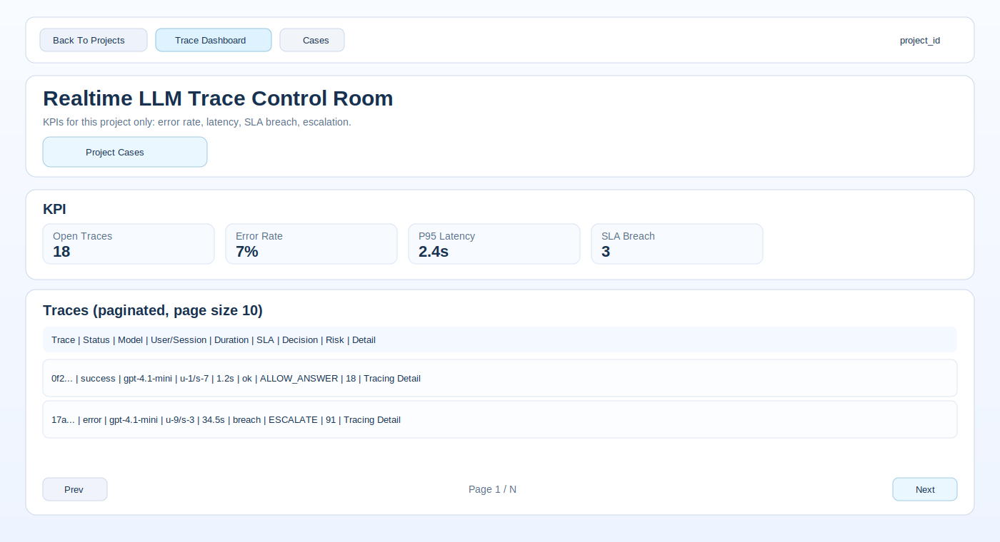
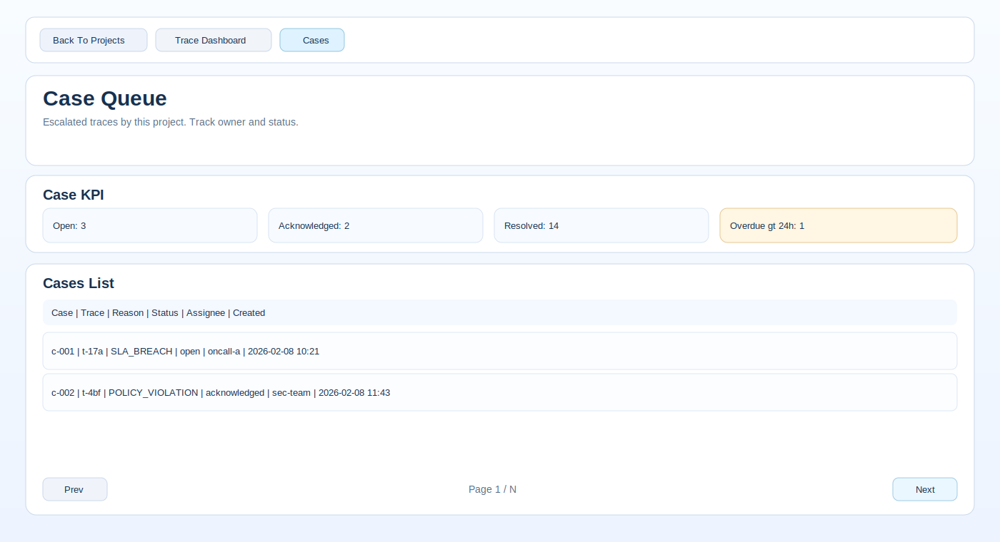
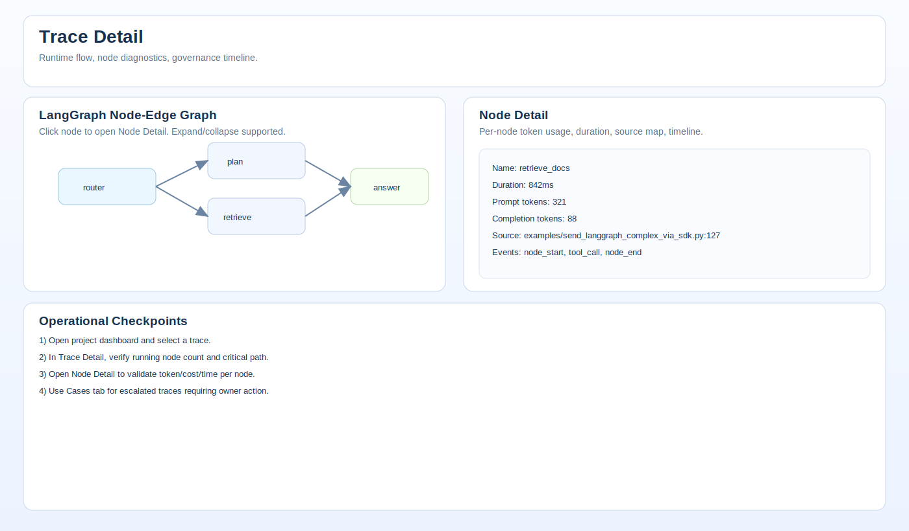

# LLM Trace Hub

Langfuse 스타일의 오픈소스 LLM Observability/Tracing MVP입니다.
현재 버전은 `Trace/Span/Event/Eval` + `Decision Engine` + `LangGraph node-level tracing` + `Cases` UI까지 포함합니다.

## 1) Monorepo

```text
backend/          FastAPI + SQLAlchemy + Alembic
frontend/         Next.js App Router
sdk/python/       Python SDK
examples/         바로 실행 가능한 trace 전송 스크립트
docs/             아키텍처/ERD 문서
docker-compose.yml
```

## 2) 핵심 기능

- Trace/Span/Event/Eval 데이터 모델
- Append-only 이벤트(`span_events`), 수정은 `AMENDMENT`
- Idempotency key 기반 중복 수집 방지
- 미종료 span 탐지(`has_open_spans`) + 완료율(`completion_rate`)
- Decision Engine
  - action: `ALLOW_ANSWER`, `BLOCK`, `ESCALATE`, `ALLOW_WITH_WARNING`, `NEED_CLARIFICATION`
  - 정책 DSL(JSON/YAML), 버전/활성화 API
  - heuristic judge + llm judge plugin
  - judge 실행 span(type=`judge`) 및 decision trace 귀속
- Cases / Notification (webhook)
- LangGraph run/node 수집 API
- Dashboard 통계 API

## 3) 빠른 실행

```bash
docker compose up --build
```

서비스:
- Frontend: `http://localhost:3000`
- Backend: `http://localhost:8000`
- Health: `http://localhost:8000/healthz`
- Postgres: `localhost:5432`

기본 API Key:
- `dev-key`

## 처음 보는 사용자를 위한 UI 가이드 (Projects 중심)

현재 UI는 `Projects`가 메인 진입점입니다.
전역 `Trace Dashboard`, `Cases`가 아니라, **프로젝트 안에서만** 대시보드/케이스를 보도록 구성되어 있습니다.

### 1) Projects 메인에서 프로젝트 생성/관리

프로젝트 생성 후 `Rotate Key`로 키를 발급하면 해당 프로젝트에서 tracing ingestion이 활성화됩니다.



### 2) 프로젝트 내부 Trace Dashboard

`Dashboard` 버튼으로 진입하면 해당 프로젝트 전용 트레이스만 보입니다.
KPI, Priority Queue, Trace 목록(10개 단위 페이징)으로 운영 상태를 빠르게 확인합니다.



### 3) 프로젝트 내부 Cases 탭

`Cases` 탭에서 에스컬레이션된 트레이스만 모아 triage 합니다.
담당자 지정, 상태 변경(ack/resolve), overdue 모니터링에 사용합니다.



### 4) Trace Detail / LangGraph Node 관측

Trace 상세에서 LangGraph Node-Edge 그래프를 보고, 노드 클릭 시 Node Detail로 들어가 토큰 사용량/지연시간/소스 매핑을 확인합니다.



### 권장 사용 순서

1. `Projects`에서 프로젝트 생성
2. `Rotate Key` 1회 실행 후 키를 SDK `.env`에 설정
3. `examples/send_langgraph_complex_via_sdk.py` 실행해 트레이스 적재
4. 프로젝트 `Dashboard`에서 trace 확인
5. `Tracing Detail`에서 노드 그래프/노드 상세 확인
6. 이슈 건은 `Cases`에서 triage

## 4) 인증

모든 API 요청 헤더:

```http
x-api-key: dev-key
```

## 5) API 개요

### Ingestion
- `POST /api/v1/ingest/traces`
- `POST /api/v1/ingest/spans`
- `POST /api/v1/ingest/langgraph-runs`
- `POST /api/v1/evals`

### Projects (admin)
- `GET /api/v1/projects`
- `POST /api/v1/projects`
- `POST /api/v1/projects/{project_id}/rotate-key`
- `GET /api/v1/projects/{project_id}/current-key`
- `POST /api/v1/projects/{project_id}/activate`
- `POST /api/v1/projects/{project_id}/deactivate`
- `DELETE /api/v1/projects/{project_id}` (soft delete = deactivate)

프로젝트 생성 직후에는 `key_activated=false` 상태입니다.
`Rotate Key`를 1회 실행해야 tracing ingestion이 활성화됩니다.

### Query
- `GET /api/v1/traces`
- `GET /api/v1/traces/{trace_id}`
- `GET /api/v1/traces/stats/overview?last_hours=24`

### Decision / Policy
- `POST /api/v1/decide`
- `POST /api/v1/policies`
- `GET /api/v1/policies`
- `GET /api/v1/policies/{policy_id}/versions`
- `POST /api/v1/policies/{policy_id}/activate?version=...`

### Cases
- `GET /api/v1/cases`
- `GET /api/v1/cases/{case_id}`
- `POST /api/v1/cases/{case_id}/ack`
- `POST /api/v1/cases/{case_id}/resolve`

상세 payload 예시는 아래 섹션 참고.

## 6) 바로 찍어보기 (추천)

### A. API 직접 전송

```bash
pip install httpx
python examples/send_trace_via_api.py
```

환경변수(선택):
- `TRACEHUB_BASE_URL` (기본 `http://localhost:8000`)
- `TRACEHUB_API_KEY` (기본 `dev-key`)

### B. SDK 전송

```bash
pip install -e sdk/python
TRACEHUB_API_KEY=<rotated_project_key> python examples/send_trace_via_sdk.py
TRACEHUB_API_KEY=<rotated_project_key> python examples/send_langgraph_trace_via_sdk.py
TRACEHUB_API_KEY=<rotated_project_key> python examples/send_langgraph_complex_via_sdk.py
```

설치 없이 실행하려면:

```bash
PYTHONPATH=sdk/python TRACEHUB_API_KEY=<rotated_project_key> python examples/send_trace_via_sdk.py
```

성공 시 출력된 `trace_id`로 확인:
- `http://localhost:3000/traces/<trace_id>`
- `http://localhost:3000/traces/<trace_id>/nodes/<node_id>`

## 7) SDK 사용

```python
from llm_trace_hub import LLMTraceClient

client = LLMTraceClient(base_url="http://localhost:8000", api_key="dev-key")

trace_id = client.start_trace(
    name="chat-request",
    input_text="질문",
    model="gpt-4.1-mini",
    environment="prod",
    user_id="user-1",
    session_id="sess-1",
)

span = client.start_span("retrieval", span_type="tool", attributes={"source": "kb"})
client.log_event("retrieved docs", metadata={"k": 5}, span_id=span.span_id)
client.end_span(status="success", span_id=span.span_id)

client.attach_eval(
    eval_name="faithfulness",
    eval_model="gpt-4.1-mini",
    score=0.9,
    passed=True,
    trace_id=trace_id,
    user_review_passed=True,
)

client.flush()
```

### LangGraph node-level

```python
trace_id = client.start_langgraph_run(
    graph_name="agent_router",
    run_id="lg-run-001",
    input_text="환불 규정 알려줘",
    model="gpt-4.1-mini",
)

client.start_langgraph_node(
    node_id="router",
    node_name="intent_router",
    node_type="router",
    input_state={"question": "환불 규정 알려줘"},
)
client.end_langgraph_node(node_id="router", output_state={"route": "policy_lookup"})

client.start_langgraph_node(
    node_id="policy_lookup",
    node_name="policy_lookup",
    node_type="tool",
    parent_node_id="router",
    input_state={"route": "policy_lookup"},
)
client.end_langgraph_node(node_id="policy_lookup", output_state={"policy_id": "refund-v3"})

client.flush()
```

필요하면 `end_langgraph_node(..., token_usage={...}, duration_ms=...)`로 노드별 사용량/시간을 명시적으로 보낼 수 있습니다.

`start_langgraph_node()`는 기본적으로 호출 지점의 소스 위치를 `metadata.source_ref`에 자동 첨부합니다.
Trace Detail 화면에서 아래를 확인할 수 있습니다.
- `LangGraph Live Nodes`: 노드 상태가 실시간(자동 refresh)으로 반영되는지
- `LangGraph Node-Edge Graph`: 노드/엣지가 어떻게 연결되었는지
- `Source` 컬럼 + `LangGraph Source Coverage`: 노드별 소스 매핑 여부
- `Node Detail`: 노드 단위 duration/token usage/source/event timeline

복잡한 시나리오를 보려면 `examples/send_langgraph_complex_via_sdk.py`를 실행하세요.
`OPENAI_API_KEY`가 있으면 GPT 호출을 사용하고, 없으면 mocked LLM 응답으로 동일한 노드 흐름을 생성합니다.

## 8) 대표 API 예시

### Trace + Span 배치 수집

```bash
curl -X POST http://localhost:8000/api/v1/ingest/traces \
  -H 'x-api-key: dev-key' -H 'content-type: application/json' \
  -d '{
    "trace": {
      "trace_id": "11111111-1111-1111-1111-111111111111",
      "status": "running",
      "start_time": "2026-02-07T10:00:00Z",
      "model": "gpt-4.1-mini",
      "environment": "prod",
      "user_id": "u-1",
      "session_id": "s-1",
      "input_text": "질문",
      "attributes": {"team": "search"}
    },
    "spans": [
      {
        "span_id": "22222222-2222-2222-2222-222222222222",
        "trace_id": "11111111-1111-1111-1111-111111111111",
        "name": "root",
        "span_type": "llm",
        "status": "running",
        "start_time": "2026-02-07T10:00:01Z",
        "idempotency_key": "trace-111-root-start"
      }
    ]
  }'
```

### LangGraph run/node 수집

```bash
curl -X POST http://localhost:8000/api/v1/ingest/langgraph-runs \
  -H 'x-api-key: dev-key' -H 'content-type: application/json' \
  -d '{
    "trace_id": "33333333-3333-3333-3333-333333333333",
    "run_id": "lg-run-001",
    "graph_name": "agent_router",
    "status": "success",
    "start_time": "2026-02-07T10:00:00Z",
    "end_time": "2026-02-07T10:00:03Z",
    "nodes": [
      {
        "node_id": "router",
        "node_name": "intent_router",
        "node_type": "router",
        "start_time": "2026-02-07T10:00:00Z",
        "end_time": "2026-02-07T10:00:01Z",
        "input_state": {"q": "hello"},
        "output_state": {"route": "search"},
        "idempotency_key": "router-1"
      },
      {
        "node_id": "search",
        "node_name": "kb_search",
        "node_type": "tool",
        "parent_node_id": "router",
        "start_time": "2026-02-07T10:00:01Z",
        "end_time": "2026-02-07T10:00:03Z",
        "input_state": {"route": "search"},
        "output_state": {"docs": 3},
        "idempotency_key": "search-1"
      }
    ]
  }'
```

## 9) 프론트 화면

- `/projects` 프로젝트(에이전트) 생성/선택
- `/` Trace Dashboard (KPI + 필터 + 목록)
- `/traces/{trace_id}` Trace Detail (span tree + timeline + langgraph node panel)
- `/traces/{trace_id}/nodes/{node_id}` Node Detail (duration/token usage/source/timeline)
- `/cases`
- `/cases/{case_id}`

프로젝트별 조회는 `project_id` 쿼리를 붙여서 사용:
- `/?project_id=<project_id>`
- `/cases?project_id=<project_id>`

관리자 프로젝트 API는 admin key가 필요합니다.
- 권장 env: `ADMIN_KEY`
- dev 환경 기본: `dev-key`

Tracing ingestion(ingest/evals)은 프로젝트 키가 `Rotate Key`로 활성화되기 전에는 `403`으로 차단됩니다.

## 10) 개발 실행 (개별)

### Backend

```bash
cd backend
pip install -e .
alembic upgrade head
python -m scripts.seed
uvicorn app.main:app --reload --port 8000
```

### Frontend

```bash
cd frontend
npm install
BACKEND_URL=http://localhost:8000 API_KEY=dev-key npm run dev
```

### SDK

```bash
cd sdk/python
pip install -e .
```

## 11) 트러블슈팅

### `409 Conflict` 발생 시
- 의미: idempotency/unique 충돌
- 조치:
  - 새 `trace_id` / 새 `idempotency_key` 사용
  - 예제 스크립트는 409 재시도 로직 포함됨

### `ModuleNotFoundError: llm_trace_hub`
- SDK 미설치 상태
- 해결:
  - `pip install -e sdk/python`
  - 또는 `PYTHONPATH=sdk/python python ...`

### `fetch failed` (프론트)
- 보통 backend 컨테이너 미기동
- 확인:
  - `docker compose ps`
  - `curl http://localhost:8000/healthz`

## 12) 참고

- 아키텍처/ERD/인덱스: `docs/ARCHITECTURE.md`
- MVP 인증 모델: project API key 단일 방식
- LLM Judge는 기본 stub, 외부 endpoint 연결 가능
