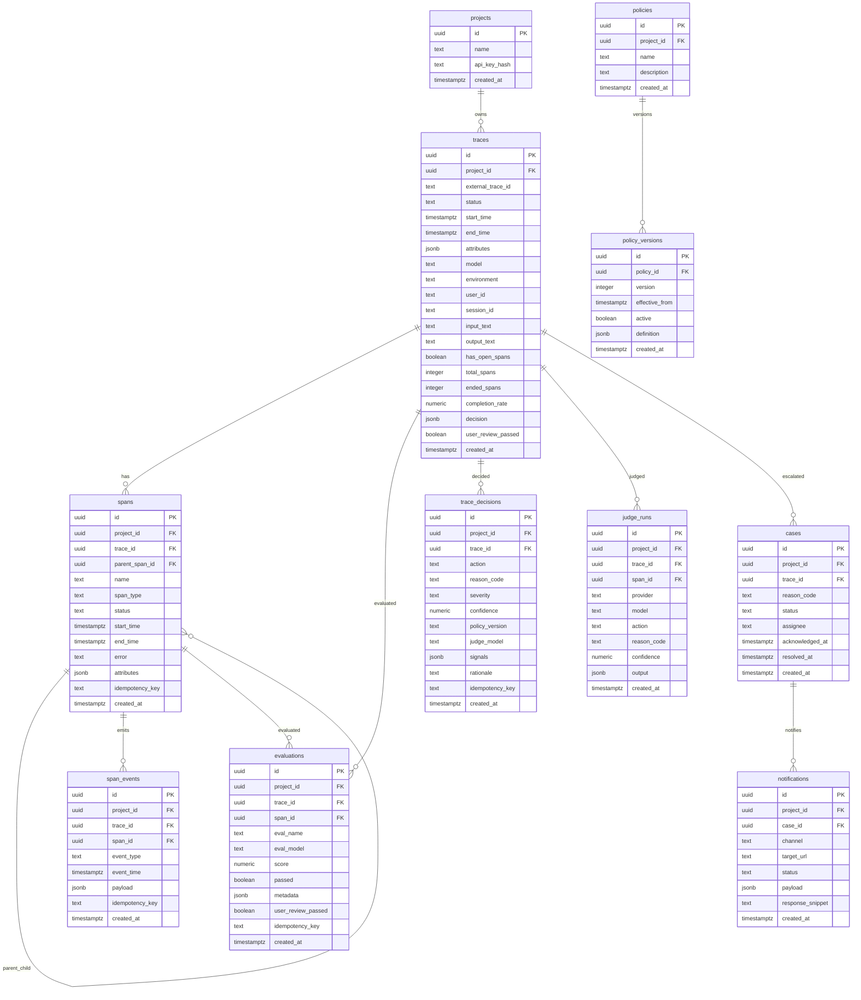

# LLM Trace Hub MVP Architecture

## Monorepo
- `backend/`: FastAPI + SQLAlchemy + Alembic
- `frontend/`: Next.js App Router
- `sdk/python/`: Python SDK

## Core Entities
- `projects`: API key scoped tenant.
- `traces`: top-level execution unit.
- `spans`: hierarchical units linked by `trace_id`, `parent_span_id`.
- `span_events`: append-only events (`SPAN_STARTED`, `SPAN_ENDED`, `LOG`, `EVENT`, `AMENDMENT`).
- `evaluations`: eval results attached to trace/span.
- `trace_decisions`: decision engine outputs and versioned runs.
- `policies`, `policy_versions`: JSON/YAML DSL policy definitions.
- `judge_runs`: explicit judge execution logs.
- `cases`: escalation case records.
- `notifications`: webhook delivery logs.

## ERD (Mermaid)


## Index Strategy
- `traces(project_id, start_time desc)` for list pagination.
- `traces(project_id, status, start_time desc)` for state filtering.
- `traces(project_id, environment, model, user_id, session_id)` composite filtering.
- `GIN` indexes on `traces.attributes` and `spans.attributes`.
- Full-text (`to_tsvector`) index on `traces.input_text`, `traces.output_text`, `span_events.payload->>'message'`.
- Unique constraints for idempotency:
  - `spans(project_id, idempotency_key)`
  - `span_events(project_id, idempotency_key)`
  - `evaluations(project_id, idempotency_key)`
  - `trace_decisions(project_id, idempotency_key)`

## Append-only Principle
- Raw event streams are immutable in `span_events`.
- State tables (`spans`, `traces`) are derived for query speed.
- Corrections are represented via `AMENDMENT` events with patch payload and optional state projection update.

## Decision Engine Pipeline
1. Load active policy version.
2. Execute heuristic provider.
3. If heuristic gives strong `BLOCK`/`ESCALATE`, short-circuit LLM judge.
4. Else execute LLM judge plugin (JSON schema validated).
5. Evaluate policy rules against request/response/eval/safety signals.
6. Persist:
   - `judge_runs`
   - a `judge` span + events
   - `trace_decisions`
   - `traces.decision` latest snapshot
7. If action = `ESCALATE`, open `cases` and trigger webhook notification.

## Policy DSL (JSON/YAML)
```yaml
policy_id: default-safety
version: 1
effective_from: 2026-01-01T00:00:00Z
rules:
  - priority: 10
    when:
      any:
        - field: "signals.pii"
          op: "eq"
          value: true
        - field: "evals.faithfulness.score"
          op: "lt"
          value: 0.3
    then:
      action: "ESCALATE"
      reason_code: "SAFETY_HIGH_RISK"
      severity: "high"
    metadata:
      owner: "trust-safety"
```
